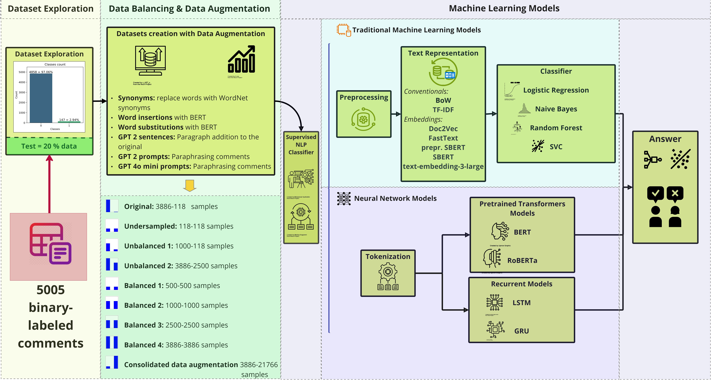
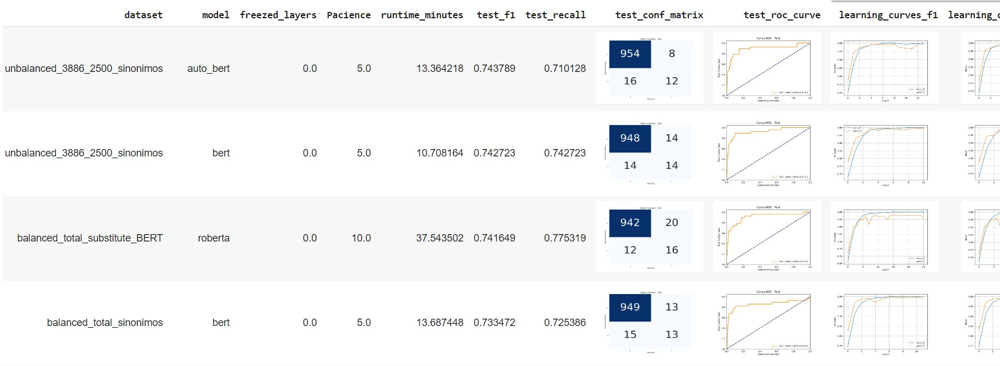
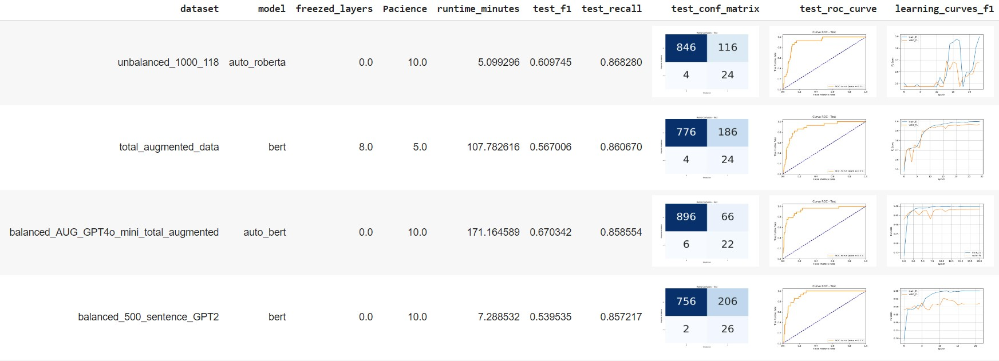

# **Universidad San Francisco de Quito - USFQ**
# **Final Project MMIA - Code and Models Results**  
*December 2024*

**Francisco Roh**

# **Detection of Accusatory Comments in Ecuadorian Public Procurement Processes using Natural Language Processing**

# **Introduction**

This study aims to analyze accusatory questions or comments within Ecuador's Official Public Procurement System (*SOCE*) using traditional machine learning models and deep learning models to detect indications of corrupt practices or corruption risks. The goal is to classify or identify such content, enabling specialists to conduct targeted analyses of high-risk contracts and develop related indicators.

# **Objectives**

This study focuses on evaluating and contrasting traditional supervised machine learning models with deep supervised models that are cost-effective and resource-efficient. Various preprocessing schemes will be employed to compare their performance in the task, aiming to minimize resource consumption by utilizing the available dataset of labeled comments as support.

Given the complexity of natural language understanding, the project seeks to identify models that do not require significant resources, with the goal of implementing early warning systems without substantial costs.

The study will employ preprocessing techniques such as **data augmentation**, **dataset balancing**, **traditional models**, **text representations and their optimization**, **Recurrent Neural Networks (RNNs)**, and **pre-trained transformers** to address this need.

This research is part of the **Master's in Artificial Intelligence thesis project**: *"Detection of Accusatory Comments in Ecuadorian Public Procurement Processes using Natural Language Processing."*

# **Considerations**

* **Six data augmentation techniques were employed**: synonyms, word insertion (*BERT*), word substitution (*BERT*), *GPT-2* sentences, *GPT-2* sentences with prompts, *GPT-4o mini* with prompts (versions 1 and 2), and their consolidated forms.

* **Each data augmentation technique was used to create various datasets** with different levels of balancing: original, undersampled, unbalanced 1, unbalanced 2, balanced 1, balanced 2, balanced 3, balanced 4, and consolidated data augmentation.

* **Two categories of models were tested**: 
  - Traditional machine learning models—**Logistic Regression**, **Naive Bayes**, **Random Forest Classifier**, and **SVC**. 
  - Neural network-based models—**Recurrent models** (GRU and LSTM) and **pre-trained NLP transformers** (*BERT* and *RoBERTa*). Programming was conducted using **Python 3** and **Google Colab**.

* **For traditional machine learning models, various text representation methods were compared**, including:
  - Conventional methods like **Bag of Words (BoW)** and **TF-IDF**.
  - Trained embeddings like **Doc2Vec**.
  - Pre-trained embeddings such as **FastText**, **SBERT**, and **text-embedding-3-large**.

* **Functions for definition and optimization** were developed for traditional models, encompassing all models and parameters under consideration.

* **Neural network-based models were implemented** using **PyTorch Lightning**, with the following components:
  - A single **Dataset class**
  - A **DataModule**
  - A **Lightning Module**
  - **Training iterations** over datasets and models

* A comprehensive **Lightning Module** was developed to handle all models and their specificities; evaluations were conducted in stages, with the code detailed succinctly below, culminating in a **summary and consolidation of all results**.

* **A comprehensive accumulation and organization of final results** were performed, covering all tested models.

* In addition to the **Loss metric**, metrics such as **Accuracy**, **Precision**, **Recall**, and **F1 score** were utilized.

* **Confusion matrices and learning curves** were generated for deeper analysis, complementing the metrics at various stages of training and testing.

* **Controls were implemented** to detect repeated or duplicated records resulting from data augmentation, which could lead to variations in dataset values.

* Experiments were conducted on an **A100 system** with **80 GB of GPU memory**.

* **Remember to properly parameterize** the folder paths according to the experiments to be performed, required files, and managed folders.

# **Code Methodology**
To replicate the study using code, it must follow the base methodology employed:

This code is located in the file `Proyecto_Final_MMIA_FRoh.ipynb` within the `Code` folder. Identified code sections corresponding to each stage of the methodology have been created and must be executed in the order described below:

# ***Packages and Libraries***
First, all necessary packages and libraries must be loaded and declared. This section includes general-purpose libraries and most of the specialized ones.

# ___Dataset Exploration___
In the Dataset Exploration stage, the following code sections should be executed, properly parameterizing folder and file paths:
## Loading and Reviewing Base Information (Dataset)
Explore and understand the original dataset found in the `Files` folder (`dataset.xlsx`).
## Definition of Train and Test Dataset
The original dataset is subdivided for training and future model evaluations.

# ___Data Balancing & Data Augmentation___
In this stage, the following code sections must be executed in this order to create the 36 different datasets with data augmentation techniques such as size and balancing.

## Datasets Creation with Data Augmentation
## Data Augmentation Methods. 
Properly parameterize paths and filenames for the backup files of each data augmentation technique to be used subsequently to create the datasets.
### Wordnet, BERT - Insertion, BERT - Substitution
### GTP2 Generation
### GTP2 with Prompt Generation
### GTP4o Mini with Prompt Generation. 
Create an OpenAI account and acquire the respective `API_KEY` for embedding generation using the API.

## Structuring of Datasets (Dataset Dictionary According to Documentation, Combination of Data Augmentation and Balancing Methods)
Retrieve the files from the respective paths of the previously created data augmentation techniques. Each dataset must be clearly identified as they will be used as parameters in the model code.
### Additional GPT-4o Mini Prompting Dataset - Version 2 (for Comparison)
This dataset is based on a different generation using GPT-4o Mini for comparison (by Bryan Núñez). The file is located in the `Files` folder (`train_datasetAUG.csv`) and is referred to in the study as GPT-4o Mini Version 2.
### Consolidated Data Augmentation Dataset: Additional GPT-4o Mini Prompting Dataset (Version 2) + Total_Augmented_Data Dataset
This is a consolidated dataset combining all the data augmentation techniques used in the study along with Version 2 from the previous point.

# ___Machine Learning Models - Supervised NLP Classifier___
At this point, all datasets to be evaluated with the models are loaded into memory. You can now choose to process traditional machine learning models or deep neural network-based models.

## ___Traditional Machine Learning Models___
To process the Traditional Machine Learning Models, the following sections must be executed:
### Preprocessing and Loading Pretrained Files
Ensure proper parameterization of the folder paths for these models and for the embeddings to be generated. Additionally, before executing this section, unzip the file `a_cc.es.300.zip` located in the `Files` folder, and place the file `a_cc.es.300.vec` in the appropriate path, updating the code if required. This file is used to obtain pretrained embeddings using the FastText technique. Ensure the `OPENAI_API_KEY` for generating `text-embedding-3-large` embeddings is correctly entered.
### Definition of Text Representations: Conventional and Embeddings
### Generation of Text Representations: Conventional and Embeddings
Generate embeddings using the datasets and embedding techniques available, adjusting parameter lists used in this and subsequent sections alongside the various models.
### Definition of Models and Optimization Techniques
Training and evaluation of traditional machine learning models.
Ensure the appropriate paths for embedding files, results, and generated model figures are used. Select the embeddings, models, datasets, and optimization parameters as required. In this study, all indicated were utilized (due to the high resource consumption of the SVC model, certain considerations were made to avoid calculating some secondary results that require many hours of processing).
### Training and Evaluation of Traditional ML Models with SBERT Embeddings (Sentence Transformers) with Preprocessed Text
Ensure proper use of paths for embeddings, results, and figures of generated models. Models are trained and evaluated using the SBERT embedding technique with the `preprocessed=true` parameter to utilize preprocessed comments.

## ___Neural Network-Based Models___
Neural network-based models were implemented using PyTorch Lightning, with the following components:
- A single Dataset class
- A DataModule
- A Lightning Module
- Training iterations over datasets and models

A comprehensive Lightning Module was developed to handle all models and their specificities; evaluations were conducted in stages, with the code detailed succinctly below, culminating in a summary and consolidation of all results.

To process Neural Network-Based Models, the following sections of definitions, training, and evaluations must be executed:
### Dataset Class
### DataModule Class
### Lightning Module Class
### Neural Network-Based Models Training and Evaluation - Patience 5 and 10
### Neural Network-Based Models Training and Evaluation - Freezed Layers Review (Patience = 5)
Ensure proper use of paths for generated model files and corresponding parameter lists. At this point, the executed code will have generated both in console and result files (CSV) and images, all respective optimized model results and curves.

# **Results**
To obtain consolidated results from the generated models, the following code sections must be executed:

## Consolidation and Homologation of Results
The models were initially processed in stages, resulting in multiple intermediate files. Currently, the stage-specific code has been consolidated to encompass all tested instances, reducing the number of intermediate files. Ensure proper paths for folders and result files of the generated models.
Upon execution of this section, the file `results_final_summary_modelos.csv` will be generated, containing details of all evaluated models with all their metrics and paths to the various generated curves. This file will be used as input for the subsequent results and charts, so its location is critical to replicate subsequent code sections.

## Lists of Results and Curves by Models and Instances
Executing these sections provides listings of top models based on F1 Score and Recall, with their respective metrics and curves:
**Top F1 Score**

**Top Recall**

In the `Results` folder, the file `Models_Results.xlsx` is also available, containing all evaluated models with their respective metrics and curves graphically, for consolidated and manageable visualization. For better visualization, view it locally.

## Results Review
The following code sections correspond to generating summary charts, hypothesis tests, and other results. The charts are generated in the console, and highlighted charts are saved in SVG format, so ensure correct path definitions. These results are classified into the following sections:

### Patience Selection
- #### Training Runtime
- #### Hypothesis Test for Patience
- #### Patience x Model: Runtime and Metrics
- #### F1 and Recall NN Models by Patience

### F1 and Recall of NN Models by Freezed_Layers
- #### Hypothesis Test
- #### Hypothesis Test - Version II
- #### F1 and Recall of NN Models by Freezed_Layers

### Metric Charts by Dimensions
- #### Model Training Times by Embeddings
- #### F1 and Recall in ML Models by Embedding - Binary
- #### F1 and Recall in NN Models by Balance - Macro
- #### F1 and Recall in ML Models by Balance - Binary
- #### F1 and Recall in NN Models by Dataset_Size - Macro
- #### F1 and Recall in ML Models by Dataset_Size - Binary
- #### F1 and Recall in NN Models by Data_Augmentation - Macro
- #### F1 and Recall in ML Models by Data_Augmentation - Binary
- #### F1 and Recall in NN Models by Data_Augmentation and Model - Macro
- #### F1 and Recall in ML Models by Data_Augmentation and Model - Binary
- #### F1 and Recall in NN Models by Dataset_Size and Model - Macro
- #### F1 and Recall in ML Models by Dataset_Size and Model - Binary

### Cross Metric Charts
- #### F1 x Recall: NN Model with Dataset_Size - Macro
- #### F1 x Recall: ML Model with Dataset_Size - Binary
- #### F1 x Recall: NN and ML Model with Dataset_Size (Binary Metrics)
- #### F1 x Recall: NN and ML Model with Dataset_Size (Macro Metrics)
- #### F1 x Recall: NN Model with Data_Augmentation (Macro Metrics)
- #### F1 x Recall: ML Model with Data_Augmentation (Binary Metrics)
- #### F1 x Recall: NN and ML Model with Data_Augmentation (Binary Metrics)
- #### F1 x Recall: NN and ML Model with Data_Augmentation (Macro Metrics)
- #### F1 x Recall: ML Model with Embedding (Binary Metrics)
- #### F1 x Recall: NN and ML Models with Embedding (Binary Metrics)
- #### F1 x Recall: NN and ML Models with Embedding (Macro Metrics)
- #### F1 x Recall: NN and ML Model with Dataset_Size and Data_Augmentation (Binary Metrics)
- #### F1 x Recall: NN and ML Model with Dataset_Size and Data_Augmentation (Macro Metrics)
- #### F1 x Recall: NN and ML Model with Dataset_Size and Embedding (Binary Metrics)
- #### F1 x Recall: NN and ML Model with Dataset_Size and Embedding (Macro Metrics)
- #### TP vs. FN

### Bar Charts
- #### Area ROC
- #### Binary Recall
- #### Macro Recall
- #### Binary F1 Score

### Best Models Performance Comparison (Traditional ML: Embedding: Text 3 Large and NN-Based Models: Patience 5 and 0 Freezed_Layers)
- #### Binary Metrics
- #### Hypothesis Test
